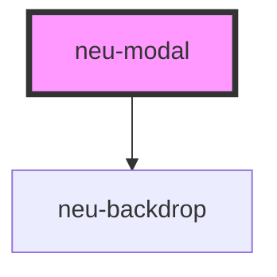

# neu-modal-bundle

<!-- Auto Generated Below -->

## Properties

| Property         | Attribute        | Description | Type      | Default     |
| ---------------- | ---------------- | ----------- | --------- | ----------- |
| `footer`         | `footer`         |             | `boolean` | `true`      |
| `header`         | `header`         |             | `boolean` | `true`      |
| `showcancel`     | `showcancel`     |             | `boolean` | `true`      |
| `showcancelicon` | `showcancelicon` |             | `boolean` | `true`      |
| `size`           | `size`           |             | `string`  | `undefined` |

## Events

| Event          | Description | Type               |
| -------------- | ----------- | ------------------ |
| `onModalClose` |             | `CustomEvent<any>` |

## Methods

### `openModal() => Promise<void>`

#### Returns

Type: `Promise<void>`

## Dependencies

### Depends on

- [neu-backdrop](..\neu-backdrop)

### Graph

----------------------------------------------

*Built with [StencilJS](https://stenciljs.com/)*
